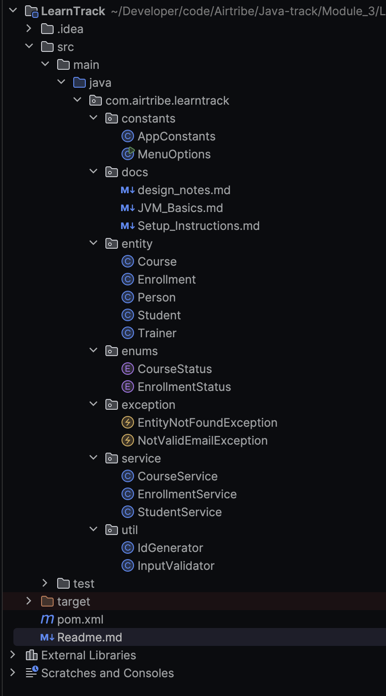
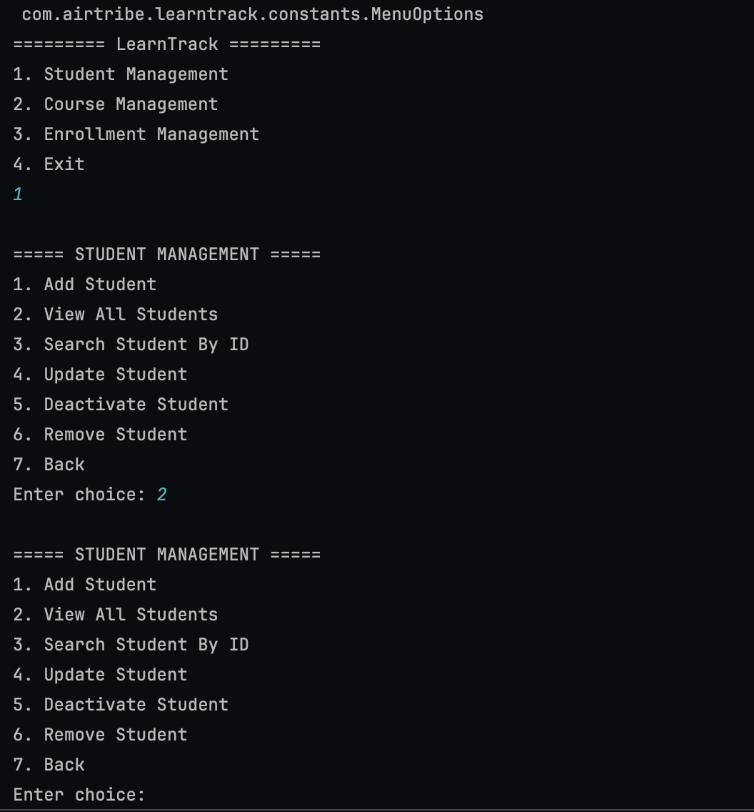

# LearnTrack
## Project Overview

LearnTrack is a console-based Student and Course Management System built using Core Java.

The project focuses on learning and demonstrating:

* Core Java Fundamentals
* Object-Oriented Programming (OOP)
* Encapsulation
* Inheritance
* Polymorphism
* Collections (ArrayList)
* Exception Handling
* Static Members and Utility Classes
* Menu-Driven Console Applications

---

## Features

### Student Management

* Add Student
* View All Students
* Search Student by ID
* Deactivate Student

### Course Management

* Add Course
* View All Courses
* Activate Course
* Deactivate Course

### Enrollment Management

* Enroll Student into Course
* View Student Enrollments
* Mark Enrollment as Completed
* Mark Enrollment as Cancelled

---

## Technologies Used

* Java 17
* Maven
* ArrayList Collections
* OOP Concepts

---

## Project Structure

## Compile and Run

### Compile

`javac MenuOption.java`

### Run

`java MenuOption`

or run Main.java directly from IntelliJ IDEA.

---

### Sample disaply menu

